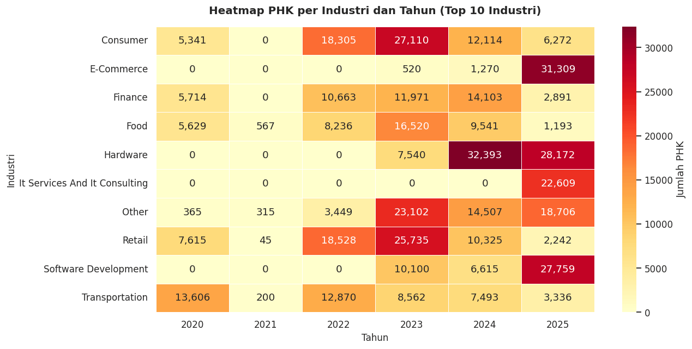
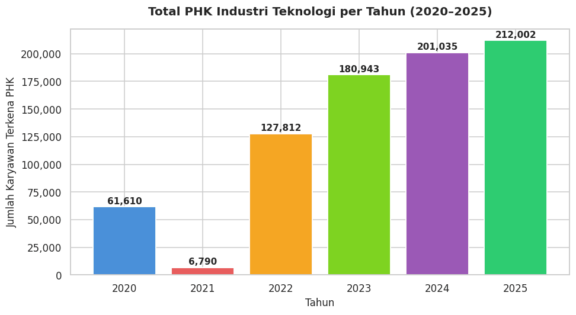
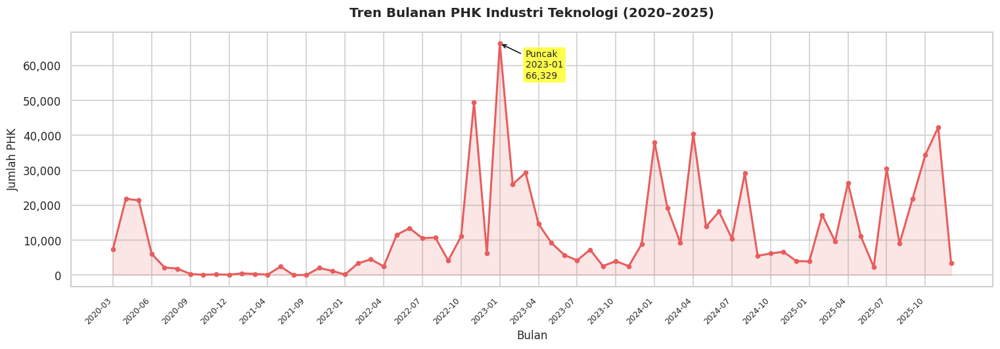
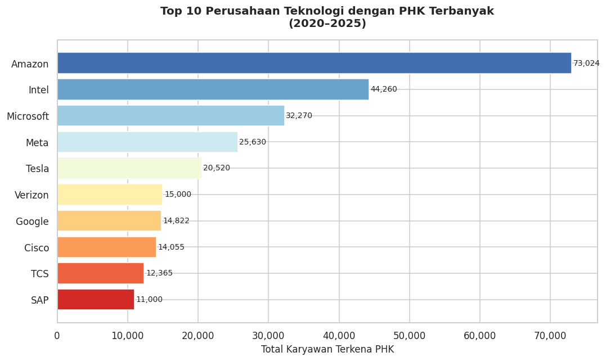

# Tech Layoffs Trend Analysis

**Who got hit the hardest by tech layoffs between 2020 and 2025, and when?**
**Siapa yang paling terdampak PHK di industri teknologi antara 2020 dan 2025, dan kapan?**

[English](#english) · [Bahasa Indonesia](#bahasa-indonesia)

---

## English

An exploratory data analysis of **2,412 tech layoff events** from **1,713 companies**, from March 2020 to December 2025. I wanted to see how the wave of tech layoffs actually played out: which years were the worst, which companies and industries cut the most jobs, and where in the world it happened.

### What I found

- **Around 790,000 people** were laid off across these events, with a median layoff of **16%** of a company's workforce.
- **It kept getting worse.** After a quiet 2021 (only 14 events), the yearly total climbed every year: about 128k in 2022, 181k in 2023, 201k in 2024 and 212k in 2025.
- **The single worst month was January 2023**, with more than 66,000 people laid off.
- **Amazon** cut the most jobs (73,024), followed by Intel (44,260) and Microsoft (32,270).
- **The industries changed over time.** Consumer and retail companies were hit hardest in 2022 and 2023. In 2024 hardware took the biggest hit, and in 2025 the cuts spread to e-commerce, software development and IT services as well.
- **Most of it happened in the US**, with roughly 573,000 of the layoffs (about 72%).

### How it was done

1. **Inspection.** Checked the 18 columns, data types, missing values and duplicates (there were none).
2. **Cleaning.** Converted the layoff dates, extracted year and month, filled missing layoff counts with the median of the same industry, filled missing percentages with the overall median, and tidied up industry and country names.
3. **Exploration.** Eight charts: yearly totals, the monthly trend, top companies, industries, countries, funding stages, a year-by-industry heatmap, and the spread of layoff percentages per year.

Because some layoff counts were missing and filled with industry medians, the totals are close estimates rather than exact counts.

### Run it yourself

1. Download the dataset from Kaggle: [Tech Layoffs 2020-2024](https://www.kaggle.com/datasets/ulrikeherold/tech-layoffs-2020-2024) (the file used here, `tech_layoffs_til_2025.csv`, runs through 2025).
2. Upload the CSV to your Google Drive.
3. Open the notebook with the **Open in Colab** button above and change `file_path` to where you put the file.
4. Run all cells.

**Built with:** Python · Pandas · NumPy · Matplotlib · Seaborn · Google Colab

---

## Bahasa Indonesia

Analisis data eksploratif terhadap **2.412 kejadian PHK** dari **1.713 perusahaan teknologi**, mulai Maret 2020 sampai Desember 2025. Saya ingin melihat bagaimana gelombang PHK di industri teknologi sebenarnya terjadi: tahun mana yang paling parah, perusahaan dan industri mana yang paling banyak memangkas karyawan, dan di negara mana saja.

### Temuan

- **Sekitar 790.000 orang** terkena PHK dari seluruh kejadian ini, dengan median **16%** dari total karyawan perusahaan.
- **Terus memburuk.** Setelah 2021 yang relatif sepi (hanya 14 kejadian), total PHK naik setiap tahun: sekitar 128 ribu di 2022, 181 ribu di 2023, 201 ribu di 2024, dan 212 ribu di 2025.
- **Bulan terburuk adalah Januari 2023**, dengan lebih dari 66.000 orang terkena PHK.
- **Amazon** paling banyak melakukan PHK (73.024 orang), disusul Intel (44.260) dan Microsoft (32.270).
- **Industri yang terdampak berubah dari waktu ke waktu.** Perusahaan consumer dan retail paling terpukul di 2022 dan 2023. Di 2024 giliran hardware yang paling terdampak, lalu di 2025 PHK meluas ke e-commerce, software development, dan IT services.
- **Sebagian besar terjadi di Amerika Serikat**, sekitar 573.000 orang (kurang lebih 72%).

### Cara pengerjaan

1. **Inspeksi.** Memeriksa 18 kolom, tipe data, missing values, dan duplikat (tidak ada duplikat).
2. **Cleaning.** Mengubah kolom tanggal ke format datetime, mengambil tahun dan bulan, mengisi jumlah PHK yang kosong dengan median per industri, mengisi persentase yang kosong dengan median keseluruhan, serta merapikan nama industri dan negara.
3. **Eksplorasi.** Delapan grafik: total per tahun, tren bulanan, top perusahaan, industri, negara, tahap pendanaan, heatmap industri per tahun, dan sebaran persentase PHK per tahun.

Karena sebagian jumlah PHK kosong dan diisi dengan median industri, angka totalnya adalah estimasi yang mendekati, bukan hitungan pasti.

### Menjalankan sendiri

1. Unduh dataset dari Kaggle: [Tech Layoffs 2020-2024](https://www.kaggle.com/datasets/ulrikeherold/tech-layoffs-2020-2024) (file yang dipakai di sini, `tech_layoffs_til_2025.csv`, sudah mencakup sampai 2025).
2. Upload file CSV ke Google Drive.
3. Buka notebook lewat tombol **Open in Colab** di atas, lalu ubah `file_path` sesuai lokasi file.
4. Jalankan semua cell.

---

Made by [Nabiel Yandra](https://github.com/nabielyr).
